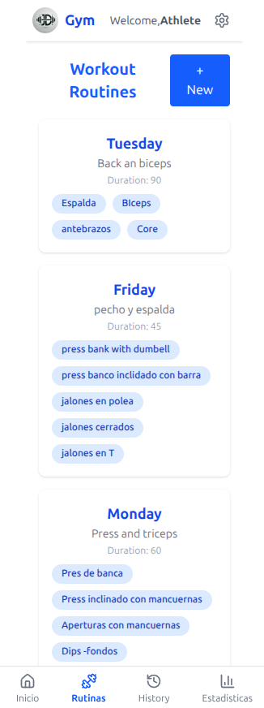
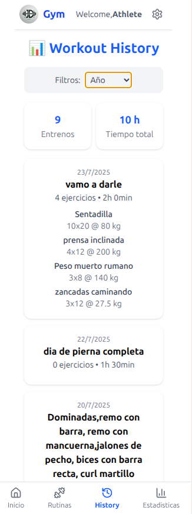
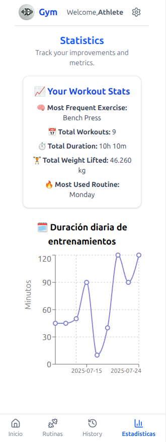

# 🏋️ RutinaFit — Workout Tracker App

**RutinaFit** is a modern and user-friendly workout tracker app built with **React**, **Tailwind CSS**, and **Supabase**. It allows users to log their workouts, track progress, view daily routines, and get inspired with a new Stoic quote every day.

---

## 🚀 Features

- 🔐 Supabase Authentication (Sign Up / Login)
- 📅 Daily personalized workout routine
- 📈 Real-time workout log and history
- ✅ Track exercise sets, reps, and weights
- 💬 Daily Stoic quote for motivation
- 🎨 Clean and responsive UI built with Tailwind CSS

---

## 🛠️ Tech Stack

- **React.js** — Frontend framework  
- **Tailwind CSS** — Utility-first CSS framework  
- **Supabase** — Backend (auth, database, API)  
- **Vite** — Fast dev server and bundler  
- **React Router** — Client-side routing  
- **date-fns** — Date formatting library

---

## 📁 Project Structure

src/
├── components/ # Reusable components
├── pages/ # Main views (Home, Profile, Workout)
├── data/ # Stoic quotes and constants
├── supabase/ # Supabase client setup
└── App.jsx # Main router


---

## 📸 Screenshots
<table>
  <tr>
    <td></td>
    <td></td>
    <td></td>
    <td></td>
  </tr>
</table>
---

## ⚙️ Getting Started

### 1. Clone the repository

```bash
git clone https://github.com/juanda404/gym-tracker
cd rutinafit
2. Install dependencies
bash
Copiar
Editar
npm install
3. Set up environment variables
Create a .env file in the root folder and add:

env
Copiar
Editar
VITE_SUPABASE_URL=https://your-project.supabase.co
VITE_SUPABASE_ANON_KEY=your-supabase-anon-key
4. Run the development server
bash
Copiar
Editar
npm run dev
🔐 Supabase Configuration
RLS (Row-Level Security) is enabled

Tables are related via user IDs from the auth.users table

Custom profiles table is used to store extended user data (e.g., full name)

✨ Future Improvements
Progress graphs and statistics

Exercise library with GIFs or demos

Social sharing or team challenges

Progressive Web App (PWA) support

👨‍💻 Author
Ing. Juan David
Frontend Developer | Fitness Enthusiast
📍 Jamundí, Colombia
LinkedIn • Portfolio

📌 Final Note
This app is a personal project that reflects my passion for both frontend development and fitness. Built with love, discipline, and some Stoic wisdom.

Feel free to contribute, fork, or get in touch!


